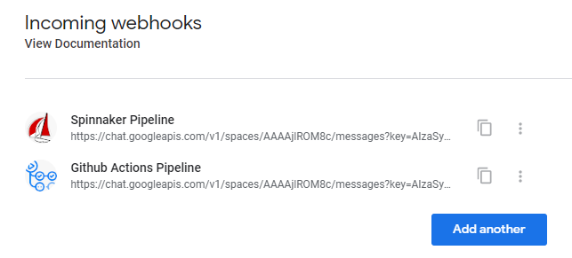
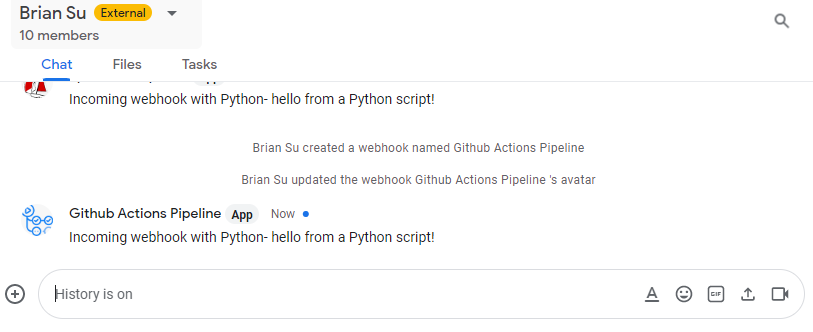

# Incoming webhook with Python to Google Chat

## Steps

```bash
pip install virtualenv
virtualenv myenv
myenv\scripts\activate
pip install httplib2
py app.py
myenv\scripts\deactivate
```

## Screenshot




